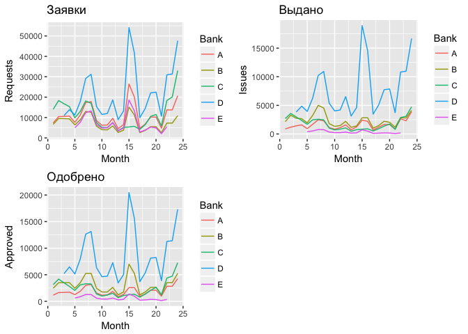

Подготовка данных
=================

Для начала считаем данные из файла и взглянем на них.

    ## # A tibble: 15 × 26
    ##     Bank                 `Operation type`           M1           M2
    ##    <chr>                            <chr>        <dbl>        <dbl>
    ## 1      А Кол-во принятых кредитных заявок 7.357101e+03 1.047682e+04
    ## 2   <NA>                Уровень одобрения 1.576522e-01 1.571524e-01
    ## 3   <NA>         Кол-во выданных кредитов 8.907748e+02 1.185449e+03
    ## 4      Б Кол-во принятых кредитных заявок 6.660232e+03 9.544878e+03
    ## 5   <NA>                Уровень одобрения 3.678551e-01 3.666888e-01
    ## 6   <NA>         Кол-во выданных кредитов 2.156000e+03 3.276000e+03
    ## 7      В Кол-во принятых кредитных заявок 1.405833e+04 1.833333e+04
    ## 8   <NA>                Уровень одобрения 2.240000e-01 2.280000e-01
    ## 9   <NA>         Кол-во выданных кредитов 2.696595e+03 3.590783e+03
    ## 10     Г Кол-во принятых кредитных заявок           NA           NA
    ## 11  <NA>                Уровень одобрения           NA           NA
    ## 12  <NA>         Кол-во выданных кредитов           NA           NA
    ## 13     Д Кол-во принятых кредитных заявок           NA           NA
    ## 14  <NA>                Уровень одобрения           NA           NA
    ## 15  <NA>         Кол-во выданных кредитов           NA           NA
    ## # ... with 22 more variables: M3 <dbl>, M4 <dbl>, M5 <dbl>, M6 <dbl>,
    ## #   M7 <dbl>, M8 <dbl>, M9 <dbl>, M10 <dbl>, M11 <dbl>, M12 <dbl>,
    ## #   M13 <dbl>, M14 <dbl>, M15 <dbl>, M16 <dbl>, M17 <dbl>, M18 <dbl>,
    ## #   M19 <dbl>, M20 <dbl>, M21 <dbl>, M22 <dbl>, M23 <dbl>, M24 <dbl>

Такую таблицу, наверное, удобно просматривать глазами, но с ней точно
неудобно работать в программе, так как она не отвечает основным
принципам *чистых данных*. Поэтому приведём её к такому виду: в каждом
ряду у нас будут месячные наблюдения по всем банкам.

    ## # A tibble: 120 × 5
    ##     Bank Month  Requests  Approval    Issues
    ##    <chr> <dbl>     <dbl>     <dbl>     <dbl>
    ## 1      A     1  7357.101 0.1576522  890.7748
    ## 2      A     2 10476.824 0.1571524 1185.4494
    ## 3      A     3 10543.939 0.1581591 1427.4826
    ## 4      A     4 10702.785 0.1605418 1580.7845
    ## 5      A     5  7656.770 0.1640736  934.6680
    ## 6      A     6 11228.961 0.1684344 1694.6438
    ## 7      A     7 17323.022 0.1732302 2472.7175
    ## 8      A     8 17804.350 0.1780435 2307.7228
    ## 9      A     9  8517.202 0.1825115 1119.2307
    ## 10     A    10  6213.480 0.1864044  843.1841
    ## # ... with 110 more rows

Данные отсортированы по месяцам внутри каждого отдельного банка. В конце
таблицы будут данные за последние месяцы 5 банка, который мы обозначили
за **E**.

    ## # A tibble: 6 × 5
    ##    Bank Month Requests   Approval    Issues
    ##   <chr> <dbl>    <dbl>      <dbl>     <dbl>
    ## 1     E    19 5325.444 0.06792465 186.44958
    ## 2     E    20 4891.304 0.06676164 167.58719
    ## 3     E    21 2089.552 0.06569175  70.20353
    ## 4     E    22 5454.545 0.06470309 180.02751
    ## 5     E    23       NA         NA        NA
    ## 6     E    24       NA         NA        NA

Тут же мы видим, что некоторые данные в таблице отсутствуют. Всего строк
с пропущенными значениями в файле 8. Это не так много, поэтому взглянем
на них.

    ## # A tibble: 8 × 5
    ##    Bank Month Requests Approval Issues
    ##   <chr> <dbl>    <dbl>    <dbl>  <dbl>
    ## 1     D     1       NA       NA     NA
    ## 2     D     2       NA       NA     NA
    ## 3     E     1       NA       NA     NA
    ## 4     E     2       NA       NA     NA
    ## 5     E     3       NA       NA     NA
    ## 6     E     4       NA       NA     NA
    ## 7     E    23       NA       NA     NA
    ## 8     E    24       NA       NA     NA

Примечательно, что от банков **D** и **E** нет информации за первые
месяцы - возможно, они недавно открылись. Более примечательно, что от
банка **E** нет информации за последние месяцы. Возникает предположение,
что это отделение закрылось. Посмотрим, есть ли какие-то очевидные
поводы для такого решения.

Изучим данные
=============

Для начала добавим в нашу таблицу столбцы с абсолютным количеством
одобренных заявок, а так же "уровень согласия" - то есть процент
одобренных заявок, на которые согласились клиенты.

    ## # A tibble: 120 × 7
    ##     Bank Month  Requests Approved    Issues  Approval Accepted
    ##    <chr> <dbl>     <dbl>    <dbl>     <dbl>     <dbl>    <dbl>
    ## 1      A     1  7357.101 1159.863  890.7748 0.1576522    0.768
    ## 2      A     2 10476.824 1646.457 1185.4494 0.1571524    0.720
    ## 3      A     3 10543.939 1667.620 1427.4826 0.1581591    0.856
    ## 4      A     4 10702.785 1718.244 1580.7845 0.1605418    0.920
    ## 5      A     5  7656.770 1256.274  934.6680 0.1640736    0.744
    ## 6      A     6 11228.961 1891.344 1694.6438 0.1684344    0.896
    ## 7      A     7 17323.022 3000.871 2472.7175 0.1732302    0.824
    ## 8      A     8 17804.350 3169.949 2307.7228 0.1780435    0.728
    ## 9      A     9  8517.202 1554.487 1119.2307 0.1825115    0.720
    ## 10     A    10  6213.480 1158.220  843.1841 0.1864044    0.728
    ## # ... with 110 more rows

Построим графики, отражающие количество заявок, одобренных заявок и
выданных кредитов в каждом банке.

Действительно, в банк E долгое время подавалось наименьшее количество
заявок, почти всегда там одобрялось наименьшее количество заявок и
всегда там выпускалось наименьшее количество кредитов. Возможно, он
находился в районе с малым числом потенциальных клиентов.
